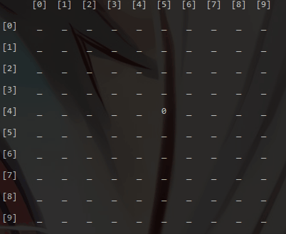

# AlphaZero-Gomoku

Play Gomoku with AlphaZero :hugs:

Trained models can be found [here](https://drive.google.com/drive/folders/12hR1CVG6KPSmv3Hrmn748-oSO-SQgwNJ). (40h on 5800x + RTX3080, 800 epochs, 16000 games)

2x speed

    
    

## 说明文档

### Features

- [x] Residual Network

- [x] Monte Carlo Tree Search (with network)

- [x] Monte Carlo Tree Search (without network)

- [x] TensorBoard 

- [x] Single player mode

- [x] Contest mode

- [x] Mixed precision

- [x] Multiprocessing

- [x] Batch inference

  

- [ ] ...

### Code Structure

大致如下图所示

### 文件说明

| agent              |                            |
| ------------------ | -------------------------- |
| mcts.py            | MCTS (with network)        |
| mcts_utils.py      | PUCT, TreeNode             |
| network.py         | PolicyValueNet             |
| network_utils.py   | feature encoder            |
| batch_inference.py | SharedData, batchInference |

| env          |        |
| ------------ | ------ |
| simulator.py | Gomoku |

| train_utils      |                    |
| ---------------- | ------------------ |
| game.py          | self play, contest |
| replay_buffer.py | store date         |

| File            | Description       |
| --------------- | ----------------- |
| train.py (main) | training pipeline |
| utils.py        | utility functions |
| config.py       | hyper-parameters  |

### Training Pipeline

1. Self Play生成数据，保存在replay buffer

2. 数据量足够后开始训练model

3. 一定数量的训练后

   - 与Best net对局，胜率>55%则更新模型

     速度更快，需要使用stochastic action selection

   - 与Pure MCTS对局，胜率>75%则更新模型

     效果更明显，后期效率较低

4. 重复

## References

### Papers

1. [_Mastering The Game of Go Without Human knowledge_](https://www.nature.com/articles/nature24270.epdf?author_access_token=VJXbVjaSHxFoctQQ4p2k4tRgN0jAjWel9jnR3ZoTv0PVW4gB86EEpGqTRDtpIz-2rmo8-KG06gqVobU5NSCFeHILHcVFUeMsbvwS-lxjqQGg98faovwjxeTUgZAUMnRQ)
2. [_Mastering Chess and Shogi by Self-Play with a General Reinforcement Learning Algorithm_](https://arxiv.org/pdf/1712.01815.pdf)

### Blogs

1. [_General Game-Playing With Monte Carlo Tree Search_](https://medium.com/@quasimik/monte-carlo-tree-search-applied-to-letterpress-34f41c86e238)
2. [_AlphaGo Zero - How and Why it Works_](http://tim.hibal.org/blog/alpha-zero-how-and-why-it-works/)
3. [_A Simple Alpha(Go) Zero Tutorial_](https://web.stanford.edu/~surag/posts/alphazero.html)
4. [_How to build your own AlphaZero AI using Python and Keras_](https://medium.com/applied-data-science/how-to-build-your-own-alphazero-ai-using-python-and-keras-7f664945c188)

### Repos

1. [_AlphaZero_Gomoku_](https://github.com/junxiaosong/AlphaZero_Gomoku)
2. [_AlphaZero-Chess_](https://github.com/DylanSnyder31/AlphaZero-Chess)
3. [_alpha-zero-gomoku_](https://github.com/hijkzzz/alpha-zero-gomoku)
4. [_AlphaZero_Gomoku_MPI_](https://github.com/initial-h/AlphaZero_Gomoku_MPI)

