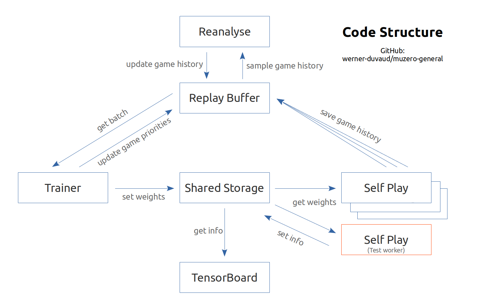

# AlphaZero Gomoku

## Description

Play Gomoku using AlphaZero :hugs:

Trained models can be found on Google Drive ([link](https://drive.google.com/drive/folders/12hR1CVG6KPSmv3Hrmn748-oSO-SQgwNJ)). 

Configuration: 40h on 5800x + RTX3080, or 800 epochs, or 16000 games

(These demo gifs are played at 2x speed.)

    
    

## Features

- [x] Multiprocessing (Parallel Environments), Batch inference

- [x] Monte Carlo Tree Search (with network)

- [x] Vanilla Monte Carlo Tree Search (without network)

- [x] TensorBoard monitor

- [x] Contest mode / Single player mode

- [x] Residual Network

  

## Code Structure

Similar to Muzero

## File Description

| agent              |                            |
| ------------------ | -------------------------- |
| mcts.py            | MCTS (with network)        |
| mcts_utils.py      | PUCT, TreeNode             |
| network.py         | PolicyValueNet             |
| network_utils.py   | feature encoder            |
| batch_inference.py | SharedData, batchInference |

| env          |        |
| ------------ | ------ |
| simulator.py | Gomoku |

| train_utils      |                    |
| ---------------- | ------------------ |
| game.py          | self play, contest |
| replay_buffer.py | store date         |

| File            | Description       |
| --------------- | ----------------- |
| train.py (main) | training pipeline |
| utils.py        | utility functions |
| config.py       | hyper-parameters  |

## Training Pipeline

1. Data are generated by self-play using Monte Carlo Tree Search and are stored in the replay buffer

2. When are enough data in the replay buffer, training is launched

3. After several times of training, the evaluation stage is activated, in which the current agent is tested against

   - The best model in history (for fast evaluation)

   - If the winning ratio is greater than 55%, the historical best model is updated by the current model

   - The vanilla Monte Carlo Tree Search (for better manifest model's performance)

## References

### Papers

1. [_Mastering The Game of Go Without Human knowledge_](https://www.nature.com/articles/nature24270.epdf?author_access_token=VJXbVjaSHxFoctQQ4p2k4tRgN0jAjWel9jnR3ZoTv0PVW4gB86EEpGqTRDtpIz-2rmo8-KG06gqVobU5NSCFeHILHcVFUeMsbvwS-lxjqQGg98faovwjxeTUgZAUMnRQ)
2. [_Mastering Chess and Shogi by Self-Play with a General Reinforcement Learning Algorithm_](https://arxiv.org/pdf/1712.01815.pdf)

### Blogs

1. [_General Game-Playing With Monte Carlo Tree Search_](https://medium.com/@quasimik/monte-carlo-tree-search-applied-to-letterpress-34f41c86e238)
2. [_AlphaGo Zero - How and Why it Works_](http://tim.hibal.org/blog/alpha-zero-how-and-why-it-works/)
3. [_A Simple Alpha(Go) Zero Tutorial_](https://web.stanford.edu/~surag/posts/alphazero.html)
4. [_How to build your own AlphaZero AI using Python and Keras_](https://medium.com/applied-data-science/how-to-build-your-own-alphazero-ai-using-python-and-keras-7f664945c188)

### Repos

1. [_AlphaZero_Gomoku_](https://github.com/junxiaosong/AlphaZero_Gomoku)
2. [_AlphaZero-Chess_](https://github.com/DylanSnyder31/AlphaZero-Chess)
3. [_alpha-zero-gomoku_](https://github.com/hijkzzz/alpha-zero-gomoku)
4. [_AlphaZero_Gomoku_MPI_](https://github.com/initial-h/AlphaZero_Gomoku_MPI)

